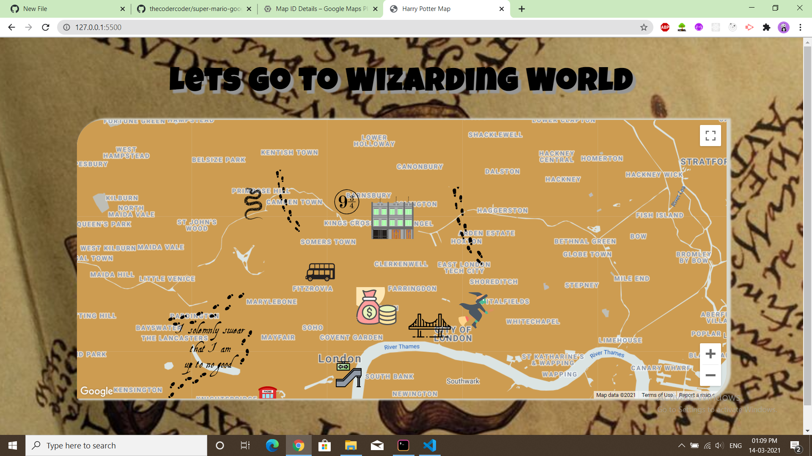
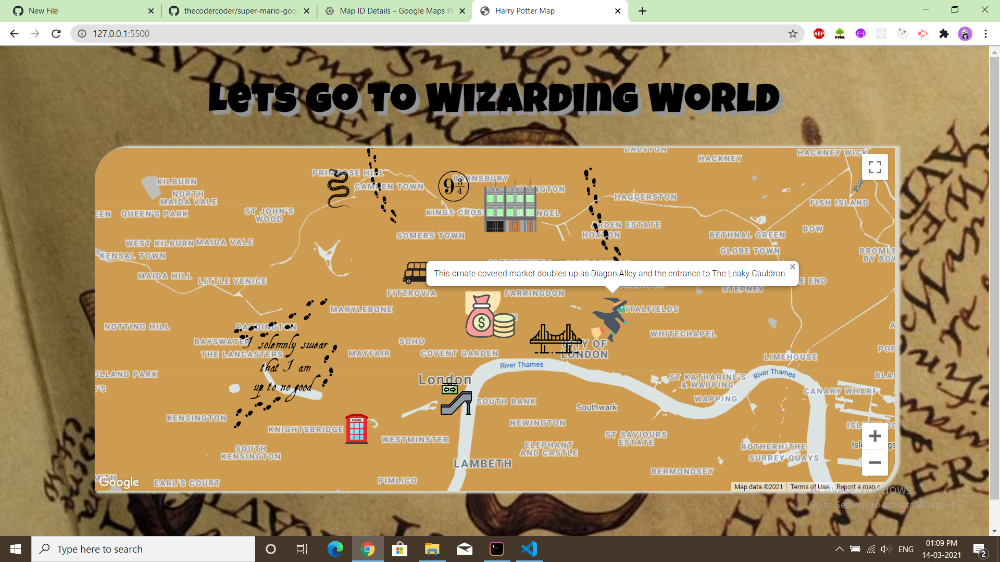

# Harry-potter-google-map
This project is built on the Google Cloud Platform and the Google Maps JavaScript API.

-> Place your API_KEY and MAP_ID in script tag for Maps API in the index.html file.

-> Add your MAP_ID in the script.js file

Screengrab:

